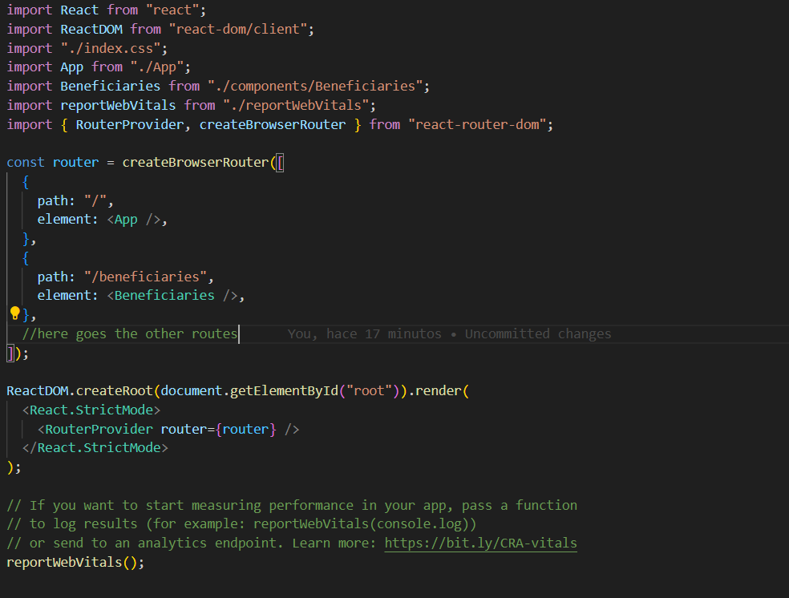
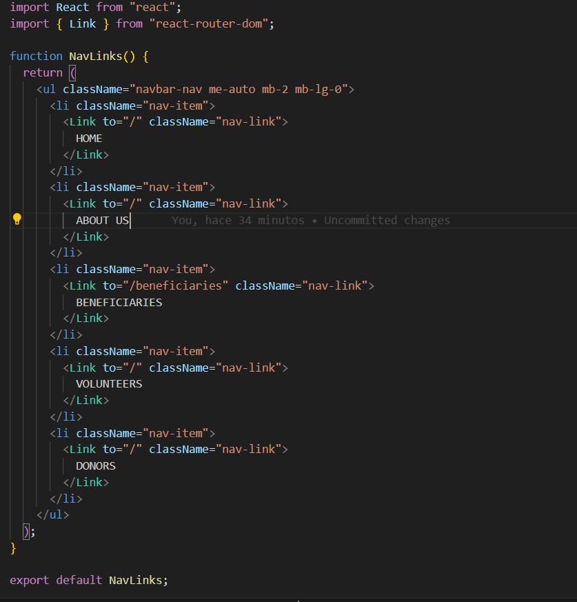

# SoulPlatesProject

Web page fullstack - social project

## Things done in this project:

### React installation:

#### npx create-react-app react-app

### Node and Nodemon instllation:

#### npm init

#### npm install --save-dev nodemon
<<<<<<< Updated upstream
=======

#### Routes are added

#### npm install react react-dom react-router-dom

### ROUTES:

##### WHEN YOU WANT TO ADD A NEW ROUTE YOU HAVE TO ADD THE PATH AND TO WHICH COMPONENT IT WILL LINK YOU. THEN IN THE PAGE YOU USE THE ROUTE, YOU HAS TO IMPORT 'LINK' FROM REACT.. AS IN THE FOLLOWING PHOTO

>>>>>>> Stashed changes
